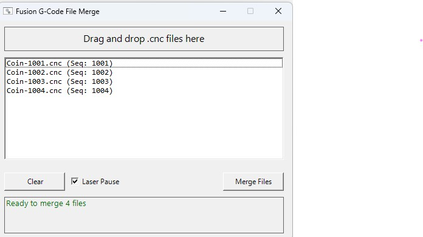

# Fusion G-Code File Merge

A Windows utility to merge multiple G-code files from Fusion 360 into a single file for CNC machines with automatic tool changers (ATC), with built-in laser support for Carvera CNC.

## Problem

Fusion 360 Personal Use license does not allow exporting G-code with multiple tools in a single file. This forces users to export separate files for each tool operation (e.g., `Job-1001.cnc`, `Job-1002.cnc`, `Job-1003.cnc`) and run them one at a time, preventing use of automatic tool changers. Additionally, Fusion 360 doesn't natively support laser modules like the Carvera's laser attachment.

## Solution

This utility merges sequenced G-code files into a single file that can be run on CNC machines with ATC support. It also automatically transforms dummy tool T99 operations into proper Carvera laser G-code, complete with surface probing for correct focal height.



## Features

- Drag-and-drop GUI interface
- Automatic file sequence detection and validation
- Validates all files have the same prefix
- Detects missing files in the sequence
- Single file processing supported (for laser-only jobs)
- Preserves proper G-code structure:
  - Header from first file (setup commands, work coordinates)
  - Tool changes and operations from each file in sequence
  - Footer from last file only (spindle stop, return home, program end)
- Adds debug comments showing source file boundaries
- Ignores `-merged.cnc` files if accidentally included in selection
- Automatically transforms dummy tool T99 into laser G-code
- Optional M600 pauses for vacuum boot removal/reinstallation (checkbox in UI)

## ⚠️ Safety Warning & Disclaimer

**This software manipulates G-code that controls CNC machinery. Improper use can result in:**
- Damaged tools, workpieces, or machine
- Personal injury
- Fire (especially with laser operations)

**Before running merged G-code:**
1. Review the merged file in a G-code viewer/simulator
2. Stay within reach of the emergency stop button during the first run
3. Start with conservative feeds and speeds until you're confident in the output
4. Never leave laser operations unattended

**Disclaimer:** This software is provided "as is" without warranty of any kind. The authors are not responsible for any damage to equipment, property, or persons resulting from the use of this software or G-code produced by it. Use at your own risk.

## Requirements

- Windows 10/11
- PowerShell 5.1+ (included with Windows)

## Usage

### Option 1: Run the EXE
Double-click `GCodeMerge.exe` to open the GUI.

### Option 2: Drag files onto the EXE
Select your `.cnc` files in Explorer and drag them onto `GCodeMerge.exe`. The GUI will open with the files pre-loaded.

### Option 3: Run the PowerShell script
```powershell
powershell -ExecutionPolicy Bypass -File "GCodeMerge.ps1"
```

### Merging Files

1. Drag and drop your sequenced `.cnc` files onto the application window
2. Verify the files are listed in the correct sequence order
3. **Laser Pause** checkbox (checked by default): When enabled, adds M600 pauses before and after laser operations so you can remove/reinstall the vacuum boot
4. Click "Merge Files"
5. The merged file will be created in the same folder as the source files with `-merged` suffix

## File Naming Convention

Files must follow this naming pattern:
```
{ProjectName}-{SequenceNumber}.cnc
```

Examples:
- `Coin-1001.cnc`
- `Coin-1002.cnc`
- `Coin-1003.cnc`

The sequence numbers must be consecutive with no gaps.

## Output

The merged file is named `{ProjectName}-merged.cnc` and placed in the same folder as the source files.

## Carvera Laser Support (T99)

The Carvera CNC has a laser module, but Fusion 360 doesn't natively support it. This utility provides a workaround by transforming dummy T99 tool operations into proper Carvera laser G-code.

### Setup in Fusion 360

1. Create a dummy tool **T99** in your Fusion 360 tool library (any tool type works)
2. Set the "spindle speed" to your desired laser power:
   - `S100` = 10% laser power
   - `S500` = 50% laser power
   - `S1000` = 100% laser power (maximum)
3. Set the "cutting feedrate" appropriate for laser engraving:
   - The Carvera's 2.5W laser needs slow feed rates (100-300 mm/min) to burn properly
   - Too fast (e.g., 1000 mm/min) will result in faint or invisible marks
   - Experiment with feed rate and power to find the right combination for your material
4. Use T99 for engraving/marking operations in your CAM setup
   - **Note:** Laser support has only been tested with **2D Milling → Trace** operations

### What the Tool Does

When T99 is detected in the G-code, the utility automatically handles the complete laser workflow. The M321 command handles Z positioning automatically.

**Job Start** (added to beginning of merged file):

```gcode
G54                     ; Ensure G54 is active
G10 L20 P2 X0 Y0 Z0     ; Backup G54 origin to G55
```

**Laser Start Sequence** (replaces `T99 M6`):

```gcode
M5                      ; Spindle stop
M321                    ; Enable laser mode (handles Z positioning)
M600                    ; Pause - remove vacuum boot for laser (optional)
M325 S##                ; Set laser power (0-100%)
M3                      ; Enable laser firing
```

**Note:** G55 serves as a backup of the original G54 coordinates. M321 handles the laser module setup including Z positioning. After laser operations, G54 is restored from the G55 backup.

**During Laser Operation**:

- All Z-axis movements are stripped (laser operates at fixed Z0)
- Repositioning moves output as G0 (laser off during rapid moves)
- Cutting moves output as G1 (laser on during linear moves)
- Power changes mid-file are detected and output as `M325 S##`

**Laser End Sequence** (when switching to next tool or end of file):

```gcode
M5                      ; Laser off
M322                    ; Disable laser mode
G0 Z20                  ; Safe retract
G55                     ; Switch to G55 (backup of original G54)
G10 L20 P1 X0 Y0 Z0     ; Restore G54 from G55 backup
G54                     ; Switch back to G54 for milling
T# M6                   ; Next tool change (if applicable)
M600                    ; Pause - reinstall vacuum boot (optional)
```

Note: The G54 restoration from G55 ensures subsequent milling operations use the original work coordinate system. The tool change happens before the M600 pause so the spindle is raised and out of the way when reinstalling the vacuum boot.

**Multiple Consecutive Laser Operations:** If you have two or more T99 laser operations in a row (without milling operations between them), the surface is only probed once at the start of the first laser operation. All consecutive laser operations are assumed to be at the same surface height. If your laser operations are on surfaces at different heights, separate them with a non-laser operation or manually adjust the G-code.

### Why Surface Probing?

If you mill your part before laser engraving (removing material), the surface height changes. The probing sequence:

1. Uses the Carvera's wireless probe (T0) to measure the actual surface height
2. Positions the laser at Z0 (focal height) relative to the probed surface
3. All laser operations run at this fixed Z0 height

This ensures the laser focal point is always correct, regardless of how much material was removed before the laser operation.

### Validation

- Laser power must be between 0-1000 (0-100%)
- An error is shown if spindle speed exceeds 1000

### Example Workflow

1. Design your part in Fusion 360
2. Create CAM operations:
   - Operations 1-2: Milling with real tools (T1, T2, etc.) - removes material
   - Operation 3: Laser engraving with dummy tool T99 - engraves on new surface
   - Operation 4: Final cutout with real tool (T1)
3. Export each operation as a separate file (Fusion Personal limitation)
4. Drop all files into this utility and merge
5. The merged file will automatically:
   - Probe the surface at the first laser position
   - Set correct laser focal height (Z0)
   - Handle laser mode enable/disable (M321/M322)
   - Convert moves to G0 (repositioning) and G1 (cutting)
   - Handle mid-file power changes

## Building the EXE

To rebuild the executable after modifying the PowerShell script:

1. Install PS2EXE module (one-time):
   ```powershell
   Install-Module -Name ps2exe -Scope CurrentUser
   ```

2. Set execution policy for the current session:
   ```powershell
   Set-ExecutionPolicy -Scope Process -ExecutionPolicy Bypass
   ```

3. Build the EXE:
   ```powershell
   Invoke-ps2exe .\GCodeMerge.ps1 .\GCodeMerge.exe -noConsole
   ```

## Tested With

- Fusion 360 Personal Use
- Makera Carvera 3-axis CNC with ATC

## Future Enhancements

- [ ] **Per-operation laser probing** - Option to probe for each laser operation when multiple T99 operations target different surface heights (e.g., engraving on stepped surfaces or pockets at different depths)
- [ ] **Per-operation laser feedrate** - Currently the feedrate from the first laser operation is used for all subsequent laser operations. If you need different feedrates for different laser operations (e.g., faster for light marking, slower for deep engraving), this is not yet supported.

## License

CC BY-NC 4.0 - Free for non-commercial use. See [LICENSE](LICENSE) for details.
